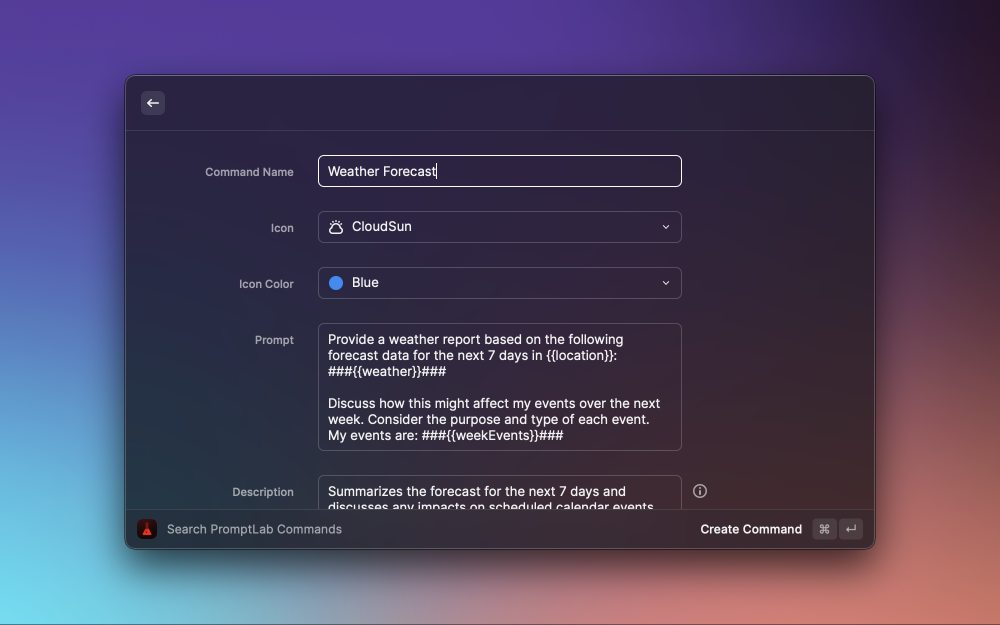
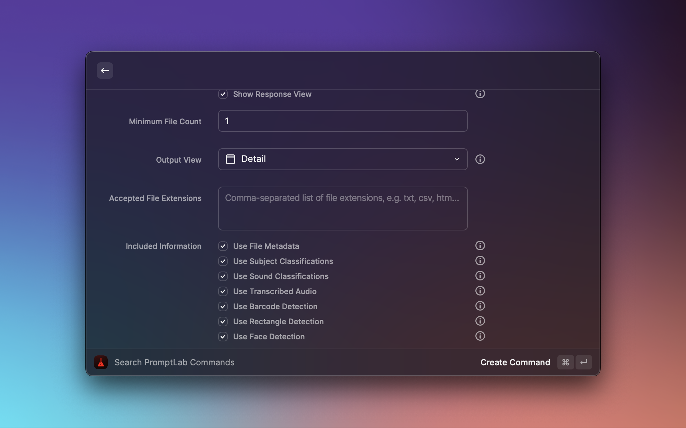
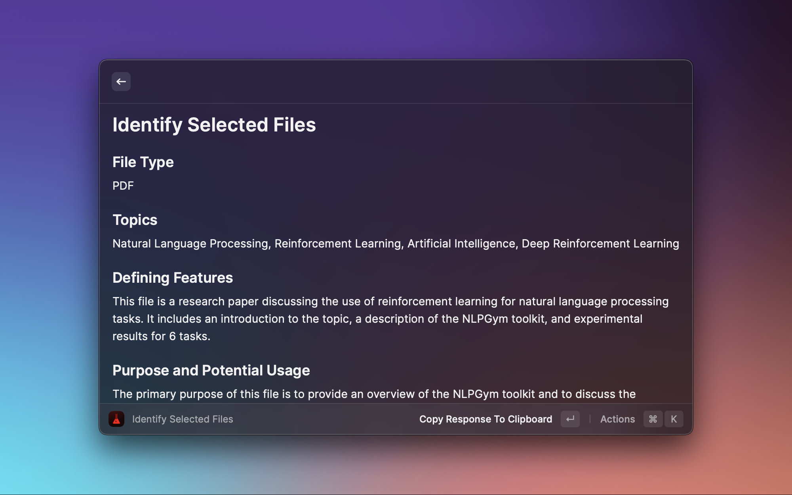
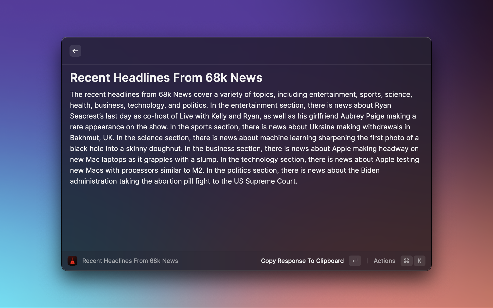
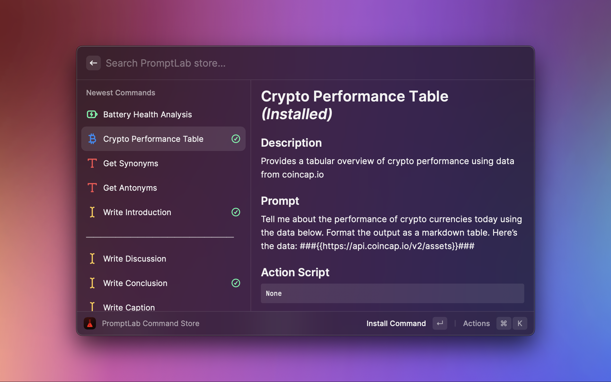

# PromptLab

A Raycast extension for creating and sharing powerful, contextually-aware AI commands using placeholders, action scripts, and more.

PromptLab allows you to create custom AI commands with prompts that utilize contextual placeholders such as {{selectedText}}, {{todayEvents}}, or {{currentApplication}} to vastly expand the capabilities of Raycast AI. PromptLab can also extract information from selected files, if you choose, so that it can tell you about the subjects in an image, summarize a PDF, and more.

PromptLab also supports "action scripts" -- AppleScripts which run with the AI's response as input. This opens a whole new world of capabilities such as allowing the AI to generate and modify files.

[My Other Extensions](https://www.raycast.com/HelloImSteven) | [Donate](https://www.paypal.com/donate/?hosted_button_id=2XFX5UXXR8M6J)

## Table Of Contents

- [Top-Level Commands](#top-level-commands)
- [Images](#images)
- [Create Your Own Commands](#create-your-own-commands)
    - [Placeholders](#placeholders)
        - [Command Placeholders](#command-placeholders)
        - [Script Placeholders](#script-placeholders)
        - [URL Placeholders](#url-placeholders)
        - [API Data Placeholders](#api-data-placeholders)
        - [Application Data Placeholders](#application-data-placeholders)
        - [Calendar Data Placeholders](#calendar-data-placeholders)
        - [Context Data Placeholders](#context-data-placeholders)
        - [File Data Placeholders](#file-data-placeholders)
        - [System Data Placeholders](#system-data-placeholders)
        - [Other Placeholders](#other-placeholders)
    - [Action Scripts](#action-scripts)
        - [Provided Variables](#provided-variables)
        - [Provided Handlers](#provided-handlers)
- [List Of Useful Prompts](#list-of-useful-prompts)
    - [Default Command Prompts](#default-command-prompts)
    - [Non-Default Command Prompts](#non-default-command-prompts)
- [Installation](#installation)
    - [Manual Installation](#manual-installation)
- [Custom Model Endpoints](#custom-model-endpoints)
- [Autonomous Agent Features](#autonomous-agent-features)
- [Contributing](#contributing)
- [Useful Resources](#useful-resources)

## Top-Level Commands

- New PromptLab Command
    - Create a custom PromptLab command accessible via 'My PromptLab Commands'
- My PromptLab Commands
    - Search and run custom PromptLab commands that you've installed or created
- PromptLab Command Store
    - Explore and search commands uploaded to the store by other PromptLab users
- Summarize Selected Files
    - Summarize the contents of selected text files, PDFs, images, audio files, and more.
- PromptLab Chat
    - Start a back-and-forth conversation with AI with selected files provided as context.       
- Import PromptLab Commands
    - Add custom commands from a JSON string.

## Images









View more images in [the gallery](https://skaplanofficial.github.io/Raycast-PromptLab/gallery).

## Create Your Own Commands

You can create custom PromptLab commands, accessed via the "My PromptLab Commands" command, to execute your own prompts acting on the contents of selected files. A variety of useful defaults are provided, as listed under [Default Commands](#default-commands).

### Placeholders

When creating custom commands, you can use placeholders in your prompts that will be substituted with relevant information whenever you run the command. These placeholders range from simple information, like the current date, to complex data retrieval operations such as getting the content of the most recent email. Placeholders are a powerful way to add context to your PromptLab prompts. The valid placeholders are as follows:

### Command Placeholders

You can use the name of any PromptLab command you have installed as a placeholder by surrounding it with double curly braces, `{{like this}}`. For example, if you have a command named "Summarize Selected Files", you can use the placeholder `{{Summarize Selected Files}}` to include the output of that command in your prompt for another command. This is useful for chaining commands together, but it also slows down the execution of your command, so use it wisely.

### Script Placeholders

You can include shell scripts and AppleScripts in your commands that will be run prior to sending the prompt to Raycast AI. The output of the script, limited to 2000 characters, will be included in the final prompt.

To use a shell script, surround the script with double curly braces and prefix it with `shell:`, `{{shell:like this}}`. For example, 'Summarize my current CPU usage: {{shell:top -ocpu -l 1}}'

To use an AppleScript script, surround the script with double curly braces and prefix it with `as:` or `as:`, `{{as:like this}}`. For example: 'Summarize this text: {{as:tell application "TextEdit" to get text of document 1}}'.

#### URL Placeholders

You can instruct PromptLab to extract text from any webpage by using the {{URL}} placeholder. For example, `{{http://68k.news}}` would be replaced with the visible text of the 68k News homepage. You can use this to interface between files, data, webpages, and APIs.

#### API Data Placeholders
| Placeholder | Replaced With |
| --- | --- |
| `{{location}}` | Your current location in city, region, country format, obtained from [geojs.io](https://get.geojs.io) |
| `{{todayWeather}}` | The weather forecast for today, obtained from [open-meteo.com](https://open-meteo.com) |
| `{{weekWeather}}` | The weather forecast for the next week, obtained from [open-meteo.com](https://open-meteo.com) |

#### Application Data Placeholders
| Placeholder | Replaced With |
| --- | --- |
| `{{installedApps}}` | The list of installed applications |
| `{{lastEmail}}` | The subject, sender, and content of the most recently received email in Mail.app |
| `{{lastNote}}` | The text of the most recently edited note in Notes.app |
| `{{musicTracks}}` | The list of track titles in Music.app |
| `{{safariBookmarks}}` | List of bookmarks in Safari |
| `{{safariTopSites}}` | Your list of top visited sites in Safari |

#### Calendar Data Placeholders
| Placeholder | Replaced With |
| --- | --- |
| `{{date}}` | The current date (day number, month name, year) |
| `{{time}}` | The current name (hours and minutes) |
| `{{todayEvents}}` | Upcoming events over the next day |
| `{{weekEvents}}` | Upcoming events over the next 7 days |
| `{{monthEvents}}` | Upcoming events over the next month |
| `{{yearEvents}}` | Upcoming events over the next year |
| `{{todayReminders}}` | Upcoming reminders of the next day |
| `{{weekReminders}}` | Upcoming reminders over the next 7 days |
| `{{monthReminders}}` | Upcoming reminders over the next month |
| `{{yearReminders}}` | Upcoming reminders over the next year |

#### Context Data Placeholders
| Placeholder | Replaced With |
| --- | --- |
| `{{clipboardText}}` | The text of the clipboard |
| `{{currentApplication}}` | The name of the current application |
| `{{currentDirectory}}` | The path of the current directory |
| `{{currentTabText}}` | The text content of the active tab of the active browser |
| `{{currentTrack}}` | The title of the track/stream currently playing in Music.app |
| `{{currentURL}}` | The current URL of the active tab of the active browser |
| `{{fileAICommands}}` | The list of all custom PromptLab commands |
| `{{input}}` | An input string provided by either Quicklink input or the currently selected text |
| `{{selectedText}}` | The currently selected text |

#### File Data Placeholders
| Placeholder | Replaced With |
| --- | --- |
| `{{contents}}` | The contents of the selected files |
| `{{fileNames}}` | Replaced with the list of selected file names |
| `{{file:path}}` | The contents of a specific file on the disk. Adds the file to your current selection. |
| `{{files}}` | Replaced with the list of selected file paths |
| `{{metadata}}` | Replaced with the metadata of each file as a list below the file path |

#### System Data Placeholders
| Placeholder | Replaced With |
| --- | --- |
| `{{computerName}}` | The computer's name (prettified form of the hostname) |
| `{{homedir}}` | The user's home directory |
| `{{hostname}}` | The computer's hostname |
| `{{user}}` | Replaced with the logged in user's username |

#### Other Placeholders
| Placeholder | Replaced With |
| --- | --- |
| `{{END}}` | Marks the end of a prompt -- no content, metadata, or instructions will be appended after |

### Action Scripts

When configuring a PromptLab command, you can provide AppleScript code to execute once the AI finishes its response. You can access the response text via the `response` variable in AppleScript. Several convenient handlers for working with the response text are also provided, as listed below. Action Scripts can be used to build complex workflows using AI as a content provider, navigator, or decision-maker.

### Provided Variables
| Variable | Value | Type |
| --- | --- | --- |
| `input` | The selected files or text input provided to the command. | String |
| `prompt` | The prompt component of the command that was run. | String |
| `response` | The full response received from the AI. | String |

#### Provided Handlers
| Handler | Purpose | Returns |
| --- | --- | --- |
| `split(theText, theDelimiter)` | Splits text around the specified delimiter. | List of String |
| `trim(theText)` | Removes leading and trailing spaces from text. | String |
| `replaceAll(theText, textToReplace, theReplacement)` | Replaces all occurrences of a string within the given text. | String |
| `rselect(theArray, numItems)` | Randomly selects the specified number of items from a list. | List |

## List of Useful Prompts

### Default Command Prompts

| Command Name | Prompt |
| --- | --- |
| Assess Academic Validity | Assess the academic validity of the following files based on their contents, the methodologies described within, and any results obtained. Use the file names as headings. |
| Assess File Overlap | What overlaps in content or ideas exists between the following files? What are the similarities? |
| Compare Selected Files | Compare and contrast the content, purpose, and significance of the following files. What are the similarities and differences between them? Format the response as one markdown paragraph. |
| Compose Response | Compose a response to the following files in the style of an email. Sign the email with the name "{{user}}" |
| Compose Tweet | Compose a tweet based on the following files: |
| Condense Files | Condense the content of the following files as much as possible. Summarize sentences. Use abbreviations where possible. If the response includes any lists, remove them and briefly describe them instead. Condense clarifying language as much as possible. Use the file names as headings. |
| Create Action Items | Generate a markdown list of action items from the following files, using a unique identifier for each item as bold headings. If there are any errors in the files, make actions items to fix them. In a sublist of each item, provide a description, priority, estimated level of difficulty, reasonable duration for the task, and due date based on the the duration and today's date, "{{date}}". Here are the files: |
| Create Flashcards | Create 3 Anki flashcards based on the content of the following files. Format the response as markdown with the bold questions and plaintext answers. Separate each entry with '---'. |
| Create Notes | I want you to act as a notetaker. I will provide file names and their contents, and you will respond with a multi-level markdown list of well-structured, concise notes. The notes should be in your own words and should make connections between topics and ideas. Each list item should be at most 20 words long. Minimize the notes as much as possible. Here are the files: |
| Create Slides | Generate 3 or more slideshow slides for each of the following files based on their content. Each slide should have 3 or 4 meaningful bullet points. Organize the slides by topic. Format the slides as markdown lists with '---' separating each slide. Describe an image to include with each slide. Suggest links related to each slide's content. Provide an appropriate title for the slideshow at the beginning of the response. |
| Detect Bias | Identify and explain the significance of any biases in the content of the following files. Discuss what the risks and dangers of those biases are, and discuss how those risks could be minimized. |
| Extend Files | Generate new content for the following files using the same style as the rest of the file's content. Explain how the new content fits with the rest. Do not repeat the current content. Use the file names as headings. |
| Extract Code | Extract lines of code written in programming languages from the following files. Format the response as markdown code blocks. Place the programming language used in each block as the heading above it. Provide a brief description of what the code does below each block. Do not provide any other commentary. |
| Extract Emails | Extract emails from the following files and list them as markdown links: |
| Extract Named Entities | What are the named entities in the following files, and what are their meanings and purpose? Clarify any abbreviations. Format the response as markdown list of sentences with the entity terms in bold. Use the file names as headings. |
| Extract Phone Numbers | Identify all phone numbers in the following files and list them using markdown. Include anything that might be a phone number. If possible, provide the name of the person or company to which the phone number belongs. |
| Extract URLs | Extract URLs from the following files and list them as markdown links |
| Extract Visible Text | I will give you information about files, including their contents, and I want you to output the text content. Preserve the original format of the content as best as possible. Always output something. |
| Extract Vocabulary | Extract the most difficult vocabulary words from the following files and define them. Format the response as a markdown list. |
| Find Errors | What errors and inconsistencies in the following files, why are they significant, and how can I fix them? Format the response as markdown list of sentences with the file names in bold. Use the file names as headings. |
| Generate Questions | Generate questions based on the content of each of the following files, their metadata, filename, type, and other information. Format the response as a markdown list. |
| Historical Context | Based on the topics mentioned in the following files, provide a list of the top 5 most significant relevant historical facts. Additionally, provide a paragraph summarizing a historical fact that relates to the entire content of the file. |
| Identify Gaps | Identify any gaps in understanding or content that occur in the following files. Use the file names as headings. Provide content to fill in the gaps. |
| Identify Selected Files | Identify the file type and most significant features of the following files based on their content. Discuss the primary purpose of the file based on its content. Categorize the content into relevant topics. Provide an assessment of the file's utility as well a list of relevant links and brief descriptions of them. Format the response as a markdown list using "## File Type", "## Topics", "## Defining Features", "## Purpose and Potential Usage", and "## Relevant Links" as headings. |
| Identify Relationships | In one paragraph, identify any relationships that might exist between the following files based on their content and the topics they mention. Always identify some relationship, even if it is very general. Explain a use for the files together that none of them have individually. |
| Make Jingle | Create short, memorable jingles summarizing the main ideas in each of the following files, using the file names as headings. |
| Make Poem | Make rhyming poems about the the following files. Be creative and include references to the content and purpose of the file in unexpected ways. Do not summarize the file. Make each poem at least 3 stanzas long, but longer for longer files. Use the file names as markdown headings. |
| Make Song | Make a song based on the content of the following files. Provide a name for the song. |
| Meeting Agenda | Create a meeting agenda covering the contents of the following files. Use today's date and time, {{date}}, to provide headings and structure to the agenda. |
| Metadata Analysis | I want you to give several insights about files based on their metadata and file type. Do not summarize the file content, but instead relate the metadata to the content in a meaningful way. Use metadata to suggest improvements to the content. Provide detailed explanations for your suggestions. Format your response as a paragraph summary. Use the file names as headings.\nHere's the metadata:{{metadata}}\n\nHere are the files: |
| Pattern Analysis | Identify and describe any patterns or trends in the content of the following files. Use the file names as headers. Discuss patterns formed by any coordinates, rectangles, etc. Do not mention coordinates. |
| Performance Summary | Give me a detailed analysis of my CPU and RAM usage based on this data. Output two friendly paragraphs. along with a markdown table. ###{{shell:top -stats command,cpu,rsize -n 10 -l 2 -s 1 -e | tail -20 | grep -iE '(PhysMem|CPU Usage)'}}### |
| Pros And Cons | List pros and cons for the following files based on the topics mentioned within them. Format the response as a markdown list. Use the file names as headings. Do not provide any other commentary. |
| Recent Headlines From 68k News | Discuss the recent headlines from 68k News: ###{{http://68k.news}}### |
| Recommend Apps | Based on the list of apps I have installed, recommend 10 additional macOS applications that I might enjoy. Explain the significance of the relationship between each recommandation and my installed apps. Use any knowledge you have about the apps to inform your suggestions. Format the output as a markdown list. At the start, provide a paragraph analyzing common themes of my apps, directed at me. Here is the list of apps I have installed: ###{{installedApps}}### |
| Response To last Email | Generate a response to the following email:###{{lastEmail}}### |
| Split Into Text Files | Split the content of the following file into multiple logical sections. Do not put headings in their own section. Output the text of each section. Write "$$$$$" between each section. |
| Suggest PromptLab Commands | Based on my current commands for the PromptLab extension, suggest new commands to create. Provide suggestions for titles as well prompts. The prompts must be relevant to an AI that can read the content of files, get information about the system, and get outside  data such as calendar events. The commands must be unique. Format the response as a single markdown list. Here are the commands I currently have: {{fileAICommands}} |
| Suggest Fonts | Here are some fonts I have installed. Identify some trends in my font choices, then recommend 5 unique fonts that I might like based on those trends. For each recommendation, explain why I might like it in relation to other fonts I have installed. Here are the fonts: {{as:use framework "Foundation"\nset fontManager to current application's NSFontManager's\nsharedFontManager()\nset allFonts to fontManager's availableFonts() as list\nset randomFonts to {}\nrepeat 10 times\n	copy some item of allFonts to end of randomFonts\nend repeat\nreturn randomFonts}}
| Suggest Hashtags | Suggest hashtags for the following files based on their contents. Use the file names as markdown headings. |
| Suggest Improvements | Suggest improvements to the content of the following files. Use the file names as headings. Format the response as a markdown list. |
| Suggest Project Ideas | I want you to act as a project idea generator. I will provide file names and their contents, and you will response with a list of project ideas based on the content of each file. Format the response as a markdown list. Use the file names as headings. Here are the files: |
| Suggest Related PromptLab Prompts | Suggest prompts for an AI that can read the contents of selected files based on the contents of the following files. Use the file contents to create useful prompts that could act on the files. The AI does not have the ability to modify files or create new ones. All prompts should reference "the contents of the following files". |
| Suggest Title | Suggest new titles for the following files based on their content and topics mentioned. Use the file names as headings. |
| Suggest Tools | Suggest tools to use based on the topics discussed in the following files. Explain why each tool is relevant. Use the file names as headings. Do not provide any commentary other than the list of tools and their explanations. |
| Summarize Clipboard | Summarize the following text, providing specific details. ###{{clipboardText}}### |
| Summarize Current Tab | Based on the following text obtained from the active browser tab, what am I looking at? In your answer, discuss the content and meaning of the website. If the URL or the text are blank, report an error. For context, here is the url: {{currentURL}} And here is the text: ###{{currentTabText}}### |
| Summarize Last Email | Summarize my most recent email and discuss its significance. I am the recipient. Format the response as a paragraph directed to me. Here is the email: ###{{lastEmail}}### |
| Summarize Spoken Audio | Summarize and assess the the following audio files using the file names as headings. Discuss the transcribed text's purpose and significance. Here are the audio transcriptions: |
| Table Of Contents | Generate a table of contents for each of the following files based on their content. Use the file names as headings. For each item in the table, provide an percent estimation of how far into the document the associated content occurs. Format the response as a markdown list. |
| Today's Agenda | Make an agenda for my day using the following list of events. Format the output as friendly paragraph, directed at my, explaining when there is time for breaks or other activities that you recommend. Use today's date ({{date}}) as a markdown header. Here are the events: ###{{todayEvents}}### |
| Translate Files To English | Translate the following files to English, using the file names as headings. Reword the translations so that they make sense in plain English. If the phrase is well known in either English or the source language, use the most commonly accepted translation. |
| What Is This? | Based on the content of the following files, answer this question: What is this? Use the file names as headings. |
| Write Abstract | Write an abstract for the following files in the style of an academic research paper. Use the file names as headings. If the abstract includes a list, briefly describe it instead of listing all elements. |
| Write Caption | Write a two-sentence caption for these files in the style of a typical image caption, based on their contents. Use the file names as headings. The caption should summarize the content and describe its overall purpose and significance. |
| Write Conclusion | Write conclusions for the following files in the style of the rest of their content, using the file names as headers. The conclusion should wrap up the meaning, purpose, significance, pitfalls, room to improvement, and suggest plans for future work. |
| Write Discussion | Write a new discussion section for each of the following files in the style of an academic research paper. The discussion should be past tense and highlight the paper's successes. Use the file names as headings. |
| Write Introduction | Write improved introduction sections for the following files in the style of an academic research paper. Use the file names as headings. The introductions must be at least 3 paragraphs long and describe what the file's contents are about, in future tense, as well as provide background information and a summary of the results. If the introduction includes a list, briefly describe the list instead of listing all elements.`

### Non-Default Command Prompts

| Command Name | Prompt |
| --- | --- |
| Relate To Current Track | Relate and compare this file to the song {{currentTrack}}. |
| Songs I Might Like | Based on the following songs in my library, recommend new songs I might like. Output the recommendations as a markdown list. For each song, explain in terms of my other songs why you think I'd like it. The recommendations must not be in my library already. Here are the songs: """{{musicTracks}}""{{END}} |
| Suggest Names For Current Note | Suggest 3 possible names for the currently selected note. Make one concise. Here is its plaintext content: {{as:tell application "Notes"\nset theText to plaintext of item 1 of (selection as list) as text\nset maxLength to 2000\nif length of theText < maxLength then\nset maxLength to length of theText\nend if\nreturn text 1 thru maxLength of theText\nend tell}} |
| Suggest Similar Songs | Suggest songs similar to {currentTrack}}. Use "Songs Similar To {{currentTrack}}" as the header for the output. For each suggestion, provide a brief explanation.{{END}} |
| Suggest Websites | Suggest 5 new websites based on the following bookmarks. Under the heading "My Recommendations:", for each suggestion, explain why I might like it relative to my current bookmarks. Output the sites as markdown links. Provide a command-separated list of my current bookmarks at the start of your response under the heading "Current Bookmarks:". {{as:tell application "Brave Browser"\nset theBookmarks to {}\n	repeat with theFolder in bookmark folders\n		set theBookmarks to theBookmarks & (title of bookmark items of theFolder)\n	end repeat\n	return theBookmarks\nend tell}} |
| Summarize Last Note | Summarize my last note: """{{lastNote}}""" |
| Tomorrow's Agenda | Make an agenda for my day tomorrow using the following list of events. Today is {{date}}, only use events for tomorrow, ignore the rest. Format the output as friendly paragraph, directed at me. Use tomorrow's date as a heading. Here are the events:###{{weekEvents}}{{weekReminders}}### |
| Use Cases | List 5 use cases for each of the following files based on their content. Explain how each use case relates to the file. Format the response as a markdown list. Use the file names as headings. |
| User Stories | Create 5 user stories based on the contents of the following files. Format the response as a markdown list. Use each file name as a heading. |

Additional commands can be found in the [prompt-sets](./prompt-sets/) directory. Feel free to contribute your own!

## Installation

This extension is not yet published to the Raycast store. In the meantime, you can install the extension manually from this repository.

### Manual Installation
```bash
git clone https://github.com/SKaplanOfficial/Raycast-PromptLab.git && cd Raycast-PromptLab

npm install && npm run dev
```

## Custom Model Endpoints

When you first run PromptLab, you'll have the option to configure a custom model API endpoint. If you have access to Raycast AI, you can just leave everything as-is, unless you have a particular need for a different model. You can, of course, adjust the configuration via the Raycast preferences at any time.

To use any arbitrary endpoint, put the endpoint URL in the `Model Endpoint` preference field and provide your `API Key` alongside the corresponding `Authorization Type`. Then, specify the `Input Schema` in JSON notation, using `{prompt}` to indicate where PromptLab should input its prompt. Alternatively, you can specify `{basePrompt}` and `{input}` separately, for example if you want to provide content for the user and system roles separately when using the OpenAI API. Next, specify the `Output Key` of the output text within the returned JSON object. If the model endpoint returns a string, rather than a JSON object, leave this field empty. Finally, specify the `Output Timing` of the model endpoint. If the model endpoint returns the output immediately, select `Synchronous`. If the model endpoint returns the output asynchronously, select `Asynchronous`.

### OpenAI API Example

To use the OpenAI API as the model endpoint, configure the extension as follows:

| Preference Name | Value |
| --- | --- |
| Model Endpoint | https://api.openai.com/v1/chat/completions |
| API Authorization Type | Bearer Token |
| API Key | Your API key |
| Input Schema | { "model": "gpt-4", "messages": [{"role": "user", "content": "{prompt}"}], "stream": true }
| Output Key Path | choices[0].delta.content |
| Output Timing | Asynchronous |

## Autonomous Agent Features

When using PromptLab Chat, or any command that uses a chat view, you can choose to enable autonomous agent features by checking the "Allow AI To Run Commands" checkbox. This will allow the AI to run PromptLab commands on your behalf, supplying input as needed, in order to answer your queries. For example, if you ask the AI "What's the latest news?", it might run the "Recent Headlines From 68k News" command to fulfil your request, then return the results to you. This feature is disabled by default, and can be enabled or disabled at any time.

## Contributing

Contributions are welcome! Please see the [contributing guidelines](./CONTRIBUTING.md) for more information.

## Useful Resources

| Link | Category | Description |
| --- | --- | --- |
| [Best practices for prompt engineering with OpenAI API](https://help.openai.com/en/articles/6654000-best-practices-for-prompt-engineering-with-openai-api) | Prompt Engineering | Strategies for creating effective ChatGPT prompts, from OpenAI itself |
| [Techniques to improve reliability](https://github.com/openai/openai-cookbook/blob/main/techniques_to_improve_reliability.md) | Prompt Engineering | Strategies for improving reliability of GPT responses |